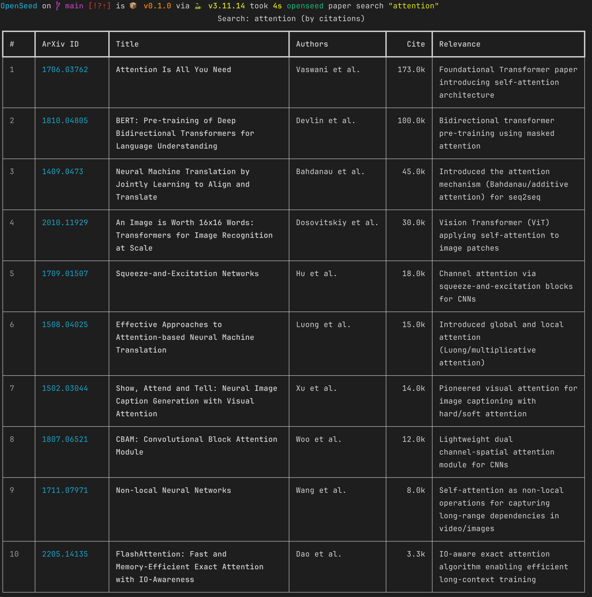

# OpenSeed

AI-powered research CLI — discover, read, and analyze academic papers with Claude.

## What it does

- **Smart search** — finds relevant papers via Claude WebSearch, ranks by real citation counts (Semantic Scholar)
- **Analysis pipeline** — search → pick papers → auto-summarize + auto-tag → save to library in one flow
- **AI summarization** — structured summaries: key contributions, methodology, limitations, relevance score
- **Experiment code gen** — generate runnable PyTorch/sklearn experiment code from a paper
- **Library management** — ArXiv import, tags, reading status, deduplication

## Search



Papers are ranked by real citation counts fetched from Semantic Scholar — not keyword matching.

## Install

```bash
pip install -e ".[dev]"
openseed doctor    # check environment
openseed setup     # configure auth
```

**Auth** — any of these work:

```bash
export ANTHROPIC_API_KEY=sk-ant-...   # Anthropic API key
# or log in via Claude CLI
claude setup-token                     # OAuth (openseed setup will detect it)
```

## Core Commands

```bash
# Search & discover
openseed paper search "diffusion models" --count 20
openseed agent search "multi-agent systems"         # deeper search with trend summary
openseed agent pipeline "ViT image classification"  # search → select → analyze → save

# Manage your library
openseed paper add https://arxiv.org/abs/1706.03762
openseed paper list
openseed paper show <id>

# Analyze papers
openseed agent summarize <id>          # English summary
openseed agent summarize <id> --cn     # Chinese summary
openseed agent review <id>             # peer review
openseed agent ask "What is RLHF?"     # research Q&A
openseed agent codegen <id>            # generate experiment code
```

## License

MIT
